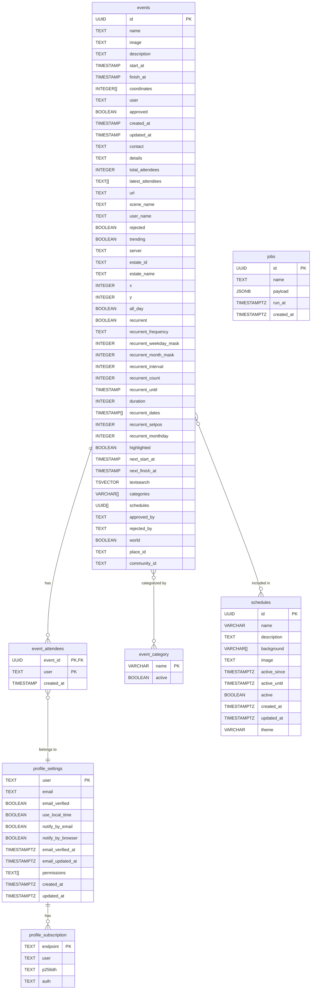

# Database Schema Documentation

This document describes the database schema for the Decentraland Events Service. The schema uses PostgreSQL and is managed through migrations located in `src/migrations/`.

## Database Schema Diagram

## Tables Overview

The database contains the following main tables:

1. **`events`** - Core event information including location, dates, recurrence, and approval status
2. **`event_attendees`** - Tracks user attendance for events
3. **`event_category`** - Defines available event categories/tags
4. **`schedules`** - Curated event collections with custom theming
5. **`profile_settings`** - User notification preferences and permissions
6. **`profile_subscription`** - Web Push subscription data for browser notifications
7. **`jobs`** - Background job queue for async processing (managed by decentraland-gatsby)

## Table: `events`

Stores all event information including one-time and recurrent events with location data, approval status, and attendance tracking.

### Columns

| Column                   | Type          | Nullable | Description                                                     |
| ------------------------ | ------------- | -------- | --------------------------------------------------------------- |
| `id`                     | UUID          | NOT NULL | **Primary Key**. Unique event identifier                        |
| `name`                   | TEXT          | NOT NULL | Event name/title                                                |
| `image`                  | TEXT          | NULL     | URL to event poster image stored in S3                          |
| `description`            | TEXT          | NULL     | Event description in markdown format                            |
| `start_at`               | TIMESTAMP     | NOT NULL | Event start time in UTC                                         |
| `finish_at`              | TIMESTAMP     | NOT NULL | Event end time in UTC                                           |
| `coordinates`            | INTEGER[]     | NOT NULL | Array of [x, y] coordinates in Decentraland Genesis City        |
| `next_start_at`          | TIMESTAMP     | NOT NULL | Next occurrence start time for recurrent events                 |
| `next_finish_at`         | TIMESTAMP     | NOT NULL | Next occurrence end time for recurrent events                   |
| `duration`               | INTEGER       | NOT NULL | Event duration in milliseconds                                  |
| `all_day`                | BOOLEAN       | NOT NULL | Whether event is all-day (default: false)                       |
| `x`                      | INTEGER       | NOT NULL | X coordinate in Decentraland Genesis City (default: 0)          |
| `y`                      | INTEGER       | NOT NULL | Y coordinate in Decentraland Genesis City (default: 0)          |
| `server`                 | TEXT          | NULL     | **Deprecated**. Server/realm name (use world field instead)     |
| `url`                    | TEXT          | NULL     | Custom event URL or external link                               |
| `scene_name`             | TEXT          | NULL     | Name of the scene where the event takes place                   |
| `user`                   | TEXT          | NOT NULL | Creator wallet address. Stored in lowercase                     |
| `user_name`              | TEXT          | NULL     | Creator display name                                            |
| `estate_id`              | TEXT          | NULL     | Associated Decentraland estate ID                               |
| `estate_name`            | TEXT          | NULL     | Estate name for display                                         |
| `approved`               | BOOLEAN       | NOT NULL | Approval status by moderator (default: false)                   |
| `rejected`               | BOOLEAN       | NOT NULL | Rejection status by moderator (default: false)                  |
| `approved_by`            | TEXT          | NULL     | Moderator wallet address who approved. Stored in lowercase      |
| `rejected_by`            | TEXT          | NULL     | Moderator wallet address who rejected. Stored in lowercase      |
| `highlighted`            | BOOLEAN       | NOT NULL | Featured/highlighted status (default: false)                    |
| `trending`               | BOOLEAN       | NOT NULL | Trending status calculated algorithmically (default: false)     |
| `recurrent`              | BOOLEAN       | NOT NULL | Whether event is recurrent (default: false)                     |
| `recurrent_frequency`    | TEXT          | NULL     | RRule frequency: YEARLY, MONTHLY, WEEKLY, DAILY, HOURLY         |
| `recurrent_setpos`       | INTEGER       | NULL     | Position in recurrence pattern (e.g., 1 for first, -1 for last) |
| `recurrent_monthday`     | INTEGER       | NULL     | Day of month for monthly recurrence (1-31)                      |
| `recurrent_weekday_mask` | INTEGER       | NOT NULL | Bitmask for weekdays (default: 0)                               |
| `recurrent_month_mask`   | INTEGER       | NOT NULL | Bitmask for months (default: 0)                                 |
| `recurrent_interval`     | INTEGER       | NOT NULL | Interval between occurrences (default: 1)                       |
| `recurrent_count`        | INTEGER       | NULL     | Total number of occurrences                                     |
| `recurrent_until`        | TIMESTAMP     | NULL     | Recurrence end date                                             |
| `recurrent_dates`        | TIMESTAMP[]   | NOT NULL | Pre-calculated array of occurrence dates (default: {})          |
| `contact`                | TEXT          | NULL     | Contact information for event organizer                         |
| `details`                | TEXT          | NULL     | Additional event details or notes                               |
| `total_attendees`        | INTEGER       | NOT NULL | Denormalized count of attendees (default: 0)                    |
| `latest_attendees`       | TEXT[]        | NOT NULL | Array of recent attendee addresses (default: {})                |
| `textsearch`             | TSVECTOR      | NULL     | Full-text search vector for name and description                |
| `categories`             | VARCHAR(50)[] | NOT NULL | Array of event category tags (default: {})                      |
| `schedules`              | UUID[]        | NOT NULL | Array of associated schedule IDs (default: {})                  |
| `world`                  | BOOLEAN       | NOT NULL | Whether event is in a virtual world vs land (default: false)    |
| `place_id`               | TEXT          | NULL     | Associated place ID from Catalyst                               |
| `community_id`           | TEXT          | NULL     | Associated community ID from Communities API                    |
| `created_at`             | TIMESTAMP     | NOT NULL | Creation timestamp (default: now())                             |
| `updated_at`             | TIMESTAMP     | NOT NULL | Last update timestamp (default: now())                          |

### Indexes

- **Primary Key**: `id`
- `idx_events_coordinates` on `(x, y)` columns for location-based queries
- `idx_events_start_at` on `start_at` column for date filtering
- `idx_events_next_start_at` on `next_start_at` column for recurrent event queries
- `idx_events_approved` on `approved` column for filtering approved events
- `idx_events_rejected` on `rejected` column for filtering rejected events
- `idx_events_textsearch` (GIN index) on `textsearch` column for full-text search
- `idx_events_categories` (GIN index) on `categories` array for category filtering
- `idx_events_sitemap` composite index for SEO sitemap generation

### Constraints

- **Primary Key uniqueness**: The `id` column must be unique
- **Date validity**: `finish_at` must be greater than `start_at`
- **Recurrence validity**: If `recurrent` is true, `recurrent_frequency` must not be null
- **Approval exclusivity**: An event cannot be both approved and rejected (`NOT (approved AND rejected)`)
- **Coordinate range**: Valid Decentraland coordinates typically range from -150 to 150

### Business Rules

- **Address normalization**: Wallet addresses in `user`, `approved_by`, and `rejected_by` fields must be stored in lowercase
- **Attendee limit**: The `latest_attendees` array is capped at a configurable limit for performance
- **Default coordinates**: Coordinates (0,0) represent Decentraland's Genesis Plaza
- **Textsearch updates**: The `textsearch` column is automatically updated via trigger when `name` or `description` changes
- **Total attendees sync**: The `total_attendees` count must match the number of records in `event_attendees` for that event
- **Next occurrence calculation**: For recurrent events, `next_start_at` and `next_finish_at` are pre-calculated for query performance

### Other

- **RRule implementation**: Recurrence follows RFC 5545 (iCalendar) specification
- **Image storage**: Event images are stored in AWS S3 and the `image` field contains the public URL
- **Categories limit**: Currently limited to 1 category per event (MAX_CATEGORIES_ALLOWED = 1)

## Table: `event_attendees`

Tracks user attendance for events with composite primary key to ensure one attendance record per user per event.

### Columns

| Column       | Type      | Nullable | Description                                                     |
| ------------ | --------- | -------- | --------------------------------------------------------------- |
| `event_id`   | UUID      | NOT NULL | **Primary Key 1, Foreign Key**. References events(id)           |
| `user`       | TEXT      | NOT NULL | **Primary Key 2**. Attendee wallet address. Stored in lowercase |
| `user_name`  | TEXT      | NULL     | Attendee display name                                           |
| `created_at` | TIMESTAMP | NOT NULL | Attendance timestamp (default: now())                           |

### Indexes

- **Composite Primary Key**: `(event_id, user)`
- `idx_event_attendees_event` on `event_id` for event attendee list queries
- `idx_event_attendees_user` on `user` for user attendance history queries

### Constraints

- **Foreign Key**: `event_id` references `events(id)` ON DELETE CASCADE
- **Composite uniqueness**: The combination of `(event_id, user)` must be unique

### Business Rules

- **Address normalization**: Wallet addresses in `user` field must be stored in lowercase
- **Attendee count sync**: When an attendance record is created or deleted, `events.total_attendees` must be updated
- **Latest attendees update**: When attendance is created, the user should be added to `events.latest_attendees` array

### Other

- **Cascade deletion**: When an event is deleted, all attendance records are automatically deleted

## Table: `event_category`

Defines available event categories/tags that can be assigned to events for filtering and discovery.

### Columns

| Column       | Type        | Nullable | Description                                                           |
| ------------ | ----------- | -------- | --------------------------------------------------------------------- |
| `name`       | VARCHAR(50) | NOT NULL | **Primary Key**. Category identifier (e.g., "music", "art", "gaming") |
| `active`     | BOOLEAN     | NOT NULL | Whether category is active and visible in UI (default: false)         |
| `created_at` | TIMESTAMPTZ | NOT NULL | Creation timestamp (default: now())                                   |
| `updated_at` | TIMESTAMPTZ | NOT NULL | Last update timestamp (default: now())                                |

### Indexes

- **Primary Key**: `name`
- `idx_event_category_active` on `active` column for filtering active categories

### Constraints

- **Primary Key uniqueness**: The `name` column must be unique
- **Name length**: Category name must not exceed 50 characters

### Business Rules

- **Active visibility**: Only active categories are displayed in the event creation UI
- **Category limit**: Events can have multiple categories but currently limited to 1 (MAX_CATEGORIES_ALLOWED = 1)

### Other

- **Available categories**: art, causes, competition, education, gambling, gaming, giveaway, health, hobbies, identity, live, music, networking, nft, other, party, play, poap, religion, shopping, social, sports, talks, town, tv

## Table: `schedules`

Curated collections of events with custom theming used for special occasions like festivals, fashion weeks, or themed event series.

### Columns

| Column         | Type          | Nullable | Description                                                     |
| -------------- | ------------- | -------- | --------------------------------------------------------------- |
| `id`           | UUID          | NOT NULL | **Primary Key**. Schedule identifier                            |
| `name`         | VARCHAR(50)   | NOT NULL | Schedule name (e.g., "Metaverse Festival 2022")                 |
| `description`  | VARCHAR(255)  | NULL     | Schedule description                                            |
| `image`        | VARCHAR(255)  | NULL     | Schedule image URL for display                                  |
| `theme`        | VARCHAR(30)   | NULL     | Theme identifier (e.g., "mvmf_2022", "mvfw_2023", "pride_2023") |
| `background`   | VARCHAR(30)[] | NOT NULL | Array of RGBA color strings for gradient background             |
| `active`       | BOOLEAN       | NOT NULL | Whether schedule is currently active (default: false)           |
| `active_since` | TIMESTAMPTZ   | NOT NULL | Schedule activation start date (default: now())                 |
| `active_until` | TIMESTAMPTZ   | NOT NULL | Schedule activation end date (default: now())                   |
| `created_at`   | TIMESTAMPTZ   | NOT NULL | Creation timestamp (default: now())                             |
| `updated_at`   | TIMESTAMPTZ   | NOT NULL | Last update timestamp (default: now())                          |

### Indexes

- **Primary Key**: `id`
- `idx_schedules_active` on `active` column for filtering active schedules
- `idx_schedules_dates` on `(active_since, active_until)` for date-based queries

### Constraints

- **Primary Key uniqueness**: The `id` column must be unique
- **Date validity**: `active_until` must be greater than `active_since`
- **Name length**: Schedule name must not exceed 50 characters

### Business Rules

- **Time-based activation**: Schedules are automatically activated/deactivated based on `active_since` and `active_until` dates
- **Background format**: Background array contains RGBA color strings for creating gradient effects in UI

### Other

- **Many-to-many relationship**: Events reference schedules via the `events.schedules` UUID array
- **Theme customization**: Theme identifier determines custom styling and branding in the frontend

## Table: `profile_settings`

Stores user preferences and notification settings with one record per user wallet address.

### Columns

| Column              | Type        | Nullable | Description                                                        |
| ------------------- | ----------- | -------- | ------------------------------------------------------------------ |
| `user`              | TEXT        | NOT NULL | **Primary Key**. User wallet address. Stored in lowercase          |
| `email`             | TEXT        | NULL     | User email address for notifications                               |
| `email_verified`    | BOOLEAN     | NOT NULL | Email verification status (default: false)                         |
| `use_local_time`    | BOOLEAN     | NOT NULL | Display event times in local timezone (default: false)             |
| `notify_by_email`   | BOOLEAN     | NOT NULL | Email notification preference (default: false)                     |
| `notify_by_browser` | BOOLEAN     | NOT NULL | Browser push notification preference (default: false)              |
| `email_verified_at` | TIMESTAMPTZ | NULL     | Timestamp when email was verified                                  |
| `email_updated_at`  | TIMESTAMPTZ | NULL     | Timestamp when email was last updated                              |
| `permissions`       | TEXT[]      | NOT NULL | Array of user permissions for admin/moderator access (default: {}) |
| `created_at`        | TIMESTAMPTZ | NOT NULL | Profile creation timestamp (default: now())                        |
| `updated_at`        | TIMESTAMPTZ | NOT NULL | Last update timestamp (default: now())                             |

### Indexes

- **Primary Key**: `user`
- `idx_profile_settings_email` on `email` column for email lookup queries
- `idx_profile_settings_permissions` (GIN index) on `permissions` array for authorization checks

### Constraints

- **Primary Key uniqueness**: The `user` column must be unique
- **Email format**: Email must be valid format when not null

### Business Rules

- **Address normalization**: Wallet addresses in `user` field must be stored in lowercase
- **Email verification required**: Email notifications only sent if `email_verified` is true
- **Browser notification dependency**: If `notify_by_browser` is true, user must have at least one record in `profile_subscription`

### Other

- **Permissions array**: Controls access to admin/moderator features like event approval/rejection
- **One profile per user**: Each wallet address has exactly one profile settings record

## Table: `profile_subscription`

Stores Web Push subscription data for browser notifications using VAPID protocol.

### Columns

| Column     | Type | Nullable | Description                                                    |
| ---------- | ---- | -------- | -------------------------------------------------------------- |
| `endpoint` | TEXT | NOT NULL | **Primary Key**. Push service endpoint URL provided by browser |
| `user`     | TEXT | NOT NULL | User wallet address. Stored in lowercase                       |
| `p256dh`   | TEXT | NOT NULL | Public key (P-256 ECDH) for message encryption                 |
| `auth`     | TEXT | NOT NULL | Authentication secret for push subscription                    |

### Indexes

- **Primary Key**: `endpoint`
- `idx_profile_subscription_user` on `user` column for user subscription lookups

### Constraints

- **Primary Key uniqueness**: The `endpoint` column must be unique (one subscription per endpoint)

### Business Rules

- **Address normalization**: Wallet addresses in `user` field must be stored in lowercase
- **Multiple subscriptions**: One user can have multiple subscriptions for different devices/browsers
- **Browser permission required**: User must grant notification permission in browser before subscription is created

### Other

- **VAPID protocol**: Uses Voluntary Application Server Identification (VAPID) for Web Push
- **Related setting**: Connected to `profile_settings.notify_by_browser` preference
- **Endpoint format**: Endpoint URL is provided by browser's Push API and uniquely identifies the subscription

## Table: `jobs`

Background job queue for async processing managed by the decentraland-gatsby framework.

### Columns

| Column       | Type        | Nullable | Description                                             |
| ------------ | ----------- | -------- | ------------------------------------------------------- |
| `id`         | UUID        | NOT NULL | **Primary Key**. Job identifier                         |
| `name`       | TEXT        | NOT NULL | Job name/type identifier (e.g., "notifyUpcomingEvents") |
| `payload`    | JSONB       | NULL     | Job input data and parameters                           |
| `run_at`     | TIMESTAMPTZ | NOT NULL | Scheduled time for job execution                        |
| `created_at` | TIMESTAMPTZ | NOT NULL | Job creation timestamp (default: now())                 |

### Indexes

- **Primary Key**: `id`
- `idx_jobs_run_at` on `run_at` column for scheduling queries
- `idx_jobs_name` on `name` column for filtering by job type

### Constraints

- **Primary Key uniqueness**: The `id` column must be unique

### Business Rules

- **Scheduled execution**: Jobs are executed when `run_at` time is reached
- **Non-blocking operations**: Jobs are processed asynchronously to avoid blocking HTTP requests

### Other

- **Common job names**: notifyUpcomingEvents, notifyStartedEvents, notifyEndedEvents, updateNextStartAt
- **Framework managed**: Managed by decentraland-gatsby framework with background workers
- **JSONB flexibility**: `payload` field uses JSONB for flexible schema-less storage
